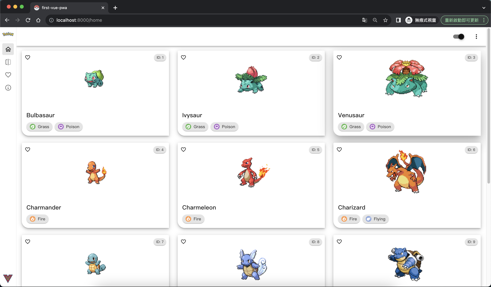

# pokedex-vue-pwa

[](LICENSE)


## Introduation
This project is a PokeDex Progressive Web App that uses the [PokeAPI](https://pokeapi.co/) to get information about pokemon.

Using a phone with pwa provides the optimal user experience.

The pokedex is deployed on vercel: 
https://vue-pwa-pokedex.vercel.app/


<br/>


## Library

- [Vue3](https://vuejs.org/) composition api
- [Vuetify](https://vuetifyjs.com/en/) for ui component 
- [Pinia](https://pinia.vuejs.org/) for store management 
- [VeeValidate](https://vee-validate.logaretm.com/v4/) for form validation, used in login form
- [Vue Router](https://router.vuejs.org/) for router

<br/>

## Desktop browser preview
<div style='display: flex;'>


</div>

<br/>

## Phone Progressive web app preview
<div style='display: flex;'>


</div>

<br/>


## Phone browser
The presence of a bottom navigation bar will be absent.

<br/>

## Project setup
```
yarn install
```

### Compiles and hot-reloads for development
```
yarn serve
```

### Compiles and minifies for production
```
yarn build
```

<br/>

## TODO
[ ] Search pokemon by types, location, generation, move and so forth \
[ ] Bit image enhance quality when zooming image \
[ ] Favourite list with own backend \
[ ] Comparison page


<br/>


## Root directory
```
first-vue-pwa
├── README.md
├── babel.config.js
├── package.json
├── public
│   ├── favicon.ico
│   ├── img
│   │   └── icons
│   │       ├── _apple-touch-icon-152x152.png
│   │       ├── _favicon-16x16.png
│   │       ├── _favicon-32x32.png
│   │       ├── _msapplication-icon-144x144.png
│   │       ├── android-chrome-192x192.png
│   │       ├── android-chrome-512x512.png
│   │       ├── android-chrome-maskable-192x192.png
│   │       ├── android-chrome-maskable-512x512.png
│   │       ├── apple-touch-icon-120x120.png
│   │       ├── apple-touch-icon-152x152.png
│   │       ├── apple-touch-icon-180x180.png
│   │       ├── apple-touch-icon-60x60.png
│   │       ├── apple-touch-icon-76x76.png
│   │       ├── apple-touch-icon.png
│   │       ├── favicon-16x16.png
│   │       ├── favicon-32x32.png
│   │       ├── icon-192x192.png
│   │       ├── icon-512x512.png
│   │       ├── msapplication-icon-144x144.png
│   │       ├── mstile-150x150.png
│   │       └── safari-pinned-tab.svg
│   ├── index.html
│   └── robots.txt
|
├── src
│   ├── App.vue
│   ├── api
│   │   └── pokemonApi.ts
│   ├── assets
│   │   ├── logo.png
│   │   ├── pokeball-icon.png
│   │   ├── pokemonTypeIcon
│   │   │   ├── bug.svg
│   │   │   ├── dark.svg
│   │   │   ├── dragon.svg
│   │   │   └── electric.svg
│   │   └── pokemonTypeIcon2
│   │       ├── Bug.png
│   │       ├── Dark.png
│   │       ├── Dragon.png
│   │       ├── Electric.png
│   │       ├── Fairy.png
│   │       ├── Fighting.png
│   │       ├── Fire.png
│   │       ├── Flying.png
│   │       ├── Ghost.png
│   │       ├── Grass.png
│   │       ├── Ground.png
│   │       ├── Ice.png
│   │       ├── Normal.png
│   │       ├── Poison.png
│   │       ├── Psychic.png
│   │       ├── Rock.png
│   │       ├── Steel.png
│   │       └── Water.png
│   ├── components
│   │   ├── AuthGuard.vue
│   │   ├── HelloWorld.vue
│   │   ├── TheWelcome.vue
│   │   ├── WelcomeItem.vue
│   │   ├── actionSheet
│   │   │   ├── MyActionSheet.vue
│   │   │   └── SearchActionSheet.vue
│   │   ├── button
│   │   │   ├── CloseButton.vue
│   │   │   ├── IconButton.vue
│   │   │   ├── LikeButton.vue
│   │   │   ├── LogoutButton.vue
│   │   │   ├── MyButton.vue
│   │   │   ├── OptionButton.vue
│   │   │   ├── ScrollButton.vue
│   │   │   ├── SelfInfoButton.vue
│   │   │   ├── SettingButton.vue
│   │   │   ├── ThemeButton.vue
│   │   │   ├── ViewStyleButton.vue
│   │   │   └── pokemonTypeListButton
│   │   │       ├── PokemonTypeListButton.vue
│   │   │       └── TypeButton.vue
│   │   ├── card
│   │   │   ├── Card.vue
│   │   │   ├── TinyCard.vue
│   │   │   └── type.ts
│   │   ├── icons
│   │   │   ├── IconCommunity.vue
│   │   │   ├── IconDocumentation.vue
│   │   │   ├── IconEcosystem.vue
│   │   │   ├── IconSupport.vue
│   │   │   └── IconTooling.vue
│   │   ├── loading
│   │   │   ├── ActionSheetLoader.vue
│   │   │   ├── PageCardSkeleton.vue
│   │   │   └── TinyCardSkeleton.vue
│   │   ├── searchField
│   │   │   ├── SearchField.vue
│   │   │   └── SearchMoveField.vue
│   │   ├── select
│   │   ├── speedDial
│   │   │   └── SpeedDial.vue
│   │   ├── tab
│   │   │   ├── PokemonItemTab.vue
│   │   │   └── TabTest.vue
│   │   └── viewContainer
│   │       └── Container.vue
│   ├── constants.ts
│   ├── hooks
│   │   ├── useDevelopmentStore.ts
│   │   ├── useLayoutStore.ts
│   │   ├── usePageStore.ts
│   │   ├── usePokemonItemStore.ts
│   │   ├── useSearchFieldStore.ts
│   │   └── useUserInfoStore.ts
│   ├── layout
│   │   ├── Footer.vue
│   │   ├── Footer2.vue
│   │   ├── FooterAllButton.vue
│   │   ├── Layout.vue
│   │   ├── drawer
│   │   │   ├── Drawer1.vue
│   │   │   ├── Drawer2.vue
│   │   │   └── Drawer3.vue
│   │   └── topNavBar
│   │       └── TopNavBar.vue
│   ├── main.ts
│   ├── mock
│   │   ├── 1xxxx.json
│   │   ├── allPokemon.json
│   │   ├── example2.json
│   │   ├── generation.json
│   │   ├── html.json
│   │   ├── pageExample.json
│   │   ├── pokemonType.json
│   │   └── temp.json
│   ├── registerServiceWorker.ts
│   ├── router
│   │   └── index.ts
│   ├── shims-vue.d.ts
│   ├── stores
│   │   └── counter.ts
│   ├── types
│   │   ├── EvolutionChain.ts
│   │   ├── PokemonItem.ts
│   │   ├── PokemonOne.ts
│   │   ├── PokemonSpecies.ts
│   │   ├── PokemonVarieties.ts
│   │   ├── RefScroll.ts
│   │   └── pokemonType.ts
│   ├── utils
│   │   ├── ResizeImage.js
│   │   ├── allPokemonType.ts
│   │   └── function.ts
│   └── views
│       ├── ActionSheet.vue
│       ├── AuthView.vue
│       ├── D1View.vue
│       ├── D2View.vue
│       ├── D3View.vue
│       ├── ErrorView.vue
│       ├── LoginView.vue
│       ├── SelfInfoView.vue
│       ├── TestView.vue
│       ├── homeView
│       │   ├── HomeView.vue
│       │   ├── HomeView2.vue
│       │   ├── PokemonInfiniteScrollView.vue
│       │   └── PokemonPaginationView.vue
│       ├── pokemonItem
│       │   ├── PokemonEvolutionChain.vue
│       │   ├── PokemonItemView.vue
│       │   ├── PokemonMoviesView.vue
│       │   └── PokemonVarietiesView.vue
│       ├── product
│       │   └── ProductView.vue
│       ├── setting
│       │   └── SettingView.vue
│       └── testView
│           └── TestView2.vue
├── tsconfig.json
├── vue.config.js
```


### Customize configuration
See [Configuration Reference](https://cli.vuejs.org/config/).

<br/>

## License

All the code available under the MIT licenses. See [LICENSE](LICENSE).